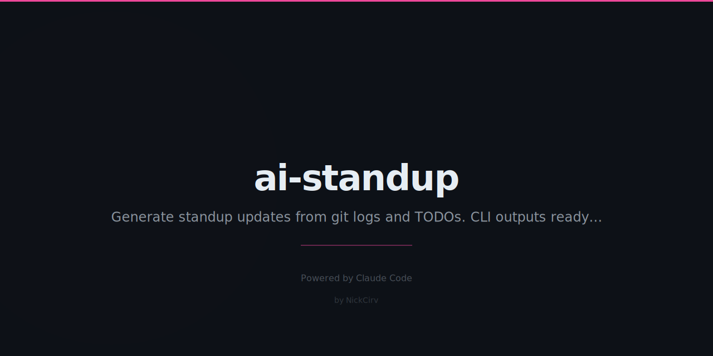

<p align="center">
  
</p>

<h1 align="center">ai-standup</h1>
<p align="center"><strong>Your standup, written for you. From your actual work.</strong></p>

<p align="center">
  <a href="#install"></a>
  
  
  
</p>

<p align="center">
  <em>Reads your git log, staged changes, TODOs, and branches. Generates Yesterday / Today / Blockers in seconds.</em>
</p>

---

It's 9:01am. Standup starts in 4 minutes. You're frantically scrolling through your git log trying to remember what you did yesterday. "I think I fixed that... thing?"

**ai-standup reads your git history and tells you exactly what you did, what you're doing, and what's blocking you.** No AI API needed — it's all local.

---

## Install

```bash
npx ai-standup                    # generate today's standup
npx ai-standup --format slack     # formatted for Slack
npx ai-standup share              # copy to clipboard
```

Or install globally:

```bash
npm install -g ai-standup
```

---

## Sample Output

```
  Daily Standup
  Tuesday, February 27, 2026
  Nick Ashkar

  Yesterday
    • feat: Added user authentication flow (3 files)
    • fix: Resolved race condition in payment webhook
    • refactor: Extracted validation middleware (2 commits)

  Today
    • Staged: src/api/billing.js, src/hooks/useSubscription.ts
    • In progress: TODO — implement retry logic for failed charges
    • Branch: feature/billing-v2 (3 days active)

  Blockers
    ⚠ Branch stale-experiment has been inactive for 14 days
    ⚠ Merge conflict detected in src/config.ts

  Repos: my-saas-app
```

---

## Slack Format

```
🔄 *Daily Standup* — Tuesday, Feb 27

*Yesterday*
• feat: Added user authentication flow
• fix: Resolved race condition in payment webhook
• refactor: Extracted validation middleware

*Today*
• Working on billing-v2 branch
• TODO: implement retry logic for failed charges

*Blockers*
⚠️ Merge conflict in src/config.ts
```

---

## All Commands

| Command | What it does |
|---------|-------------|
| `ai-standup` | Generate today's standup |
| `ai-standup log 7` | Show standups for last 7 days |
| `ai-standup config` | Set author, default repos, format |
| `ai-standup share` | Copy to clipboard (paste into Slack) |

**Key flags:** `--format text|slack|markdown|json`, `--days 3` (lookback), `--repo path` (repeat for multi-repo), `--author name`

---

## What It Reads

| Source | What it finds |
|--------|--------------|
| **Git log** | Your commits grouped by type (feat, fix, refactor, chore) |
| **Staged files** | What you're currently working on |
| **TODO/FIXME** | In-progress items from your code comments |
| **Branches** | Active branches, stale branches, conflicts |

---

## Multi-Repo Support

```bash
npx ai-standup --repo ./frontend --repo ./backend --repo ./infra
# Combines activity from all three repos into one standup
```

---

## Why Not Just Read the Git Log?

Because `git log --oneline -20` gives you hashes and prefixes. ai-standup gives you a standup. It groups by type, detects blockers, reads your TODOs, checks for conflicts, and formats it for wherever you paste it. In 200ms.

---

## Features

- **Zero API calls** — reads your local git history, no LLM required
- **Multi-repo** — aggregate commits across all your active projects
- **Smart grouping** — commits grouped by type (feat, fix, chore, etc.)
- **Blocker detection** — stale branches, merge conflicts, large uncommitted diffs
- **Todo scanning** — surfaces TODO/FIXME comments and common todo files
- **4 output formats** — text, slack, markdown, JSON
- **Clipboard** — `ai-standup share` copies directly for pasting
- **Standup log** — last 30 standups stored at `~/.ai-standup-log.json`

---

Built by [@NickCirv](https://github.com/NickCirv) · MIT License
